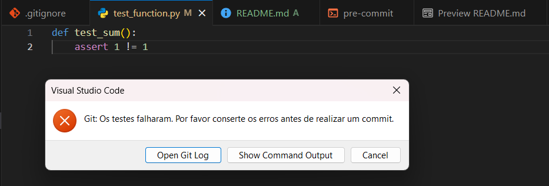

# Git hooks - Passo a passo

### 1 - Criar um repositório git
Crie um repositório git através do comando git init

### 2 - Criar o projeto
Para o exemplo, irei utilizar um projeto python simples, apenas com a biblioteca pytest.

No repositório do git, inicie um novo projeto Python com os seguintes comandos:
```bash
python -m venv env # Em sistemas Linux, o comando pode acabar sendo 'python3' ao invés de 'python'
.\env\Scripts\activate # No caso de um sistema Linux como ubuntu, utilize o seguinte comando:
# source /env/bin/activate
pip install pytest
```

Com o projeto inicial criado, crie um arquivo chamado "test_function", e digite o seguinte código:
```python
# Apenas uma função que vamos alterar manualmente para dar certo ou errado.
def test_sum():
    assert 1 == 1
```

Para testar que tudo esteja funcionando, rode o comando 'pytest' no terminal. O teste deve passar.

### 3 - Criar o git hook
Com o projeto criado, entre no diretório .git/hooks, localizado na pasta do repositório.
Se não ver essa pasta, é possível que ela apenas esteja escondida. Se for o caso, revele os arquivos escondidos e procure
por ela.

Dentro da pasta hooks, tera diversos arquivos com a extensão '.sample'. Para os propósitos deste exemplo, iremos apenas
modificar a 'pre-commit.sample', que é executada antes de todo commit.

Renomeie o arquivo 'pre-commit.sample' para apenas 'pre-commit', e após isso, edite o arquivo, colocando o seguinte
código bash dentro:

```bash
#!/bin/sh

# Altere o valor dessa string com o caminho para a pasta do projeto.
PASTA_PROJETO=""

cd $PASTA_PROJETO

# Caso esteja em um sistema Linux, altere todas as barras invertidas '\' no script para '/'.

# O caminho a seguir está assumindo um sistema windows. Caso esteja em um sistema linux, altere para o caminho apropriado do script de ativação. Normalmente seria '/env/bin/activate'.
# É possível que 'source' não seja reconhecido em sistemas linux. Utilize '.' no lugar, caso seja o seu caso.
source $PASTA_PROJETO"\env\Scripts\activate"

mkdir -p $PASTA_PROJETO"\results"

pytest > $PASTA_PROJETO"\results\temp.txt"
EXIT_CODE=$?

if [ $EXIT_CODE -ne 0 ]; then
    echo "Os testes falharam. Por favor conserte os erros antes de realizar um commit."
    exit 1
fi

exit 0
```

### 4 - Teste o projeto

Altere o projeto de alguma forma, e altere o teste de forma que ele falhe de alguma forma. Ao tentar realizar algum commit
com um teste falhando, você ira receber uma mensagem do próprio git, impedindo realizar o commit do projeto enquanto
tiver algum teste falhando:

